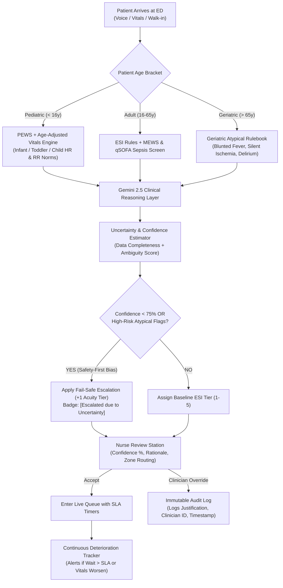

#  FHIR-Triage AI: Emergency Department Patient Triage & Dynamic Queue Intelligence Assistant

> **PS-1 / Round 2 Solution**: A clinical-grade, age-stratified, safety-first Emergency Department (ED) triage assistant that prioritizes arriving patients in real-time, calculates explicit uncertainty bounds, actively tracks waiting-room deterioration, and exports HL7 FHIR R4-compliant interoperable records with regulatory-compliant clinician override audit logging.

---

##  Table of Contents
1. [Executive Summary & Problem Context](#-executive-summary--problem-context)
2. [Key Real-World Complexities Addressed](#-key-real-world-complexities-addressed)
3. [Architecture & Decision Model](#-architecture--decision-model)
4. [Age-Stratified Scoring Framework](#-age-stratified-scoring-framework)
5. [Asymmetric Risk & Safety-First Escalation](#-asymmetric-risk--safety-first-escalation)
6. [Dynamic Queue & Waiting Room Deterioration Engine](#-dynamic-queue--waiting-room-deterioration-engine)
7. [Regulatory Compliance & Immutable Audit Logging (HIPAA / GDPR / ABDM)](#-regulatory-compliance--immutable-audit-logging)
8. [Surge Mode Simulation (3× Volume)](#-surge-mode-simulation-3-volume)
9. [Pre-Configured Simulated Patient Cohort (20 Cases)](#-pre-configured-simulated-patient-cohort-20-cases)
10. [HL7 FHIR R4 Interoperability](#-hl7-fhir-r4-interoperability)
11. [Quick Start & Setup Instructions](#-quick-start--setup-instructions)

---

##  Executive Summary & Problem Context

In high-volume Emergency Departments (EDs), intake triage occurs in seconds under intense time pressure and incomplete information. Emergency Department triage uses a 5-level severity index (ESI 1 to 5):
- **ESI 1 (Resuscitation)**: Immediate life-saving intervention needed ($0\text{ min}$ wait).
- **ESI 2 (Emergent)**: High-risk situation, severe pain/distress, altered mental status ($< 15\text{ min}$ wait).
- **ESI 3 (Urgent)**: Stable vitals but requires multiple ED resources/diagnostics ($< 30\text{ min}$ wait).
- **ESI 4 (Semi-Urgent)**: Requires one simple resource (e.g., X-ray, suture) ($< 60\text{ min}$ wait).
- **ESI 5 (Non-Urgent)**: Requires no ED resources (e.g., prescription refill, minor wound check) ($< 120\text{ min}$ wait).

### The Challenge
1. **Under-Triage vs. Over-Triage Asymmetry**: Missing an early sepsis or silent cardiac event can be fatal (**under-triage**), whereas over-prioritizing a cautious case (**over-triage**) only causes a minor queue shift. Standard ML models optimized for raw accuracy fail in safety-critical clinical environments.
2. **Age Heterogeneity**: Pediatric and geriatric vital signs and symptom presentations diverge radically from standard adult baselines.
3. **Data Availability Gap**: Roughly 50% of arriving patients have zero prior records on file (first-time walk-ins).
4. **Waiting Room Deterioration**: Up to 15% of waiting patients clinically deteriorate before their first physician encounter.
5. **Clinical Accountability**: AI cannot replace medical liability; every recommendation must be overridable with an immutable audit log.

**FHIR-Triage AI** solves these challenges using a **hybrid rules + LLM reasoning architecture**, incorporating **age-adjusted physiological baselines**, **explicit uncertainty quantification**, and **continuous SLA monitoring**.

---

##  Key Real-World Complexities Addressed



---

##  Asymmetric Risk & Safety-First Escalation

In medical triage, the cost function is asymmetric:
$$\text{Cost}(\text{Under-Triage}) \gg \text{Cost}(\text{Over-Triage})$$

To encode this clinical principle into code:
1. **Confidence Score Calculation ($0–100\%$)**: Evaluates symptom clarity, vital sign completeness, and prior medical history availability.
2. **First-Time / Zero-History Penalty**: First-time walk-ins with no historical baseline receive a mandatory $15\%$ uncertainty margin.
3. **Automatic Fail-Safe Escalation**:
   - If computed confidence is $< 75\%$, or if borderline vital signs exist in geriatric/pediatric patients, the system automatically promotes the patient to the next highest severity tier (e.g., ESI 3 $\rightarrow$ ESI 2).
   - The UI surfaces this transparently to the nurse: `[ Escalated due to Uncertainty: Atypical presentation in diabetic geriatric patient without chest pain]`.

---

##  Age-Stratified Scoring Framework

| Demographic | Physiological Distinctions | Scoring Systems Applied |
| :--- | :--- | :--- |
| **Pediatric (< 16y)** | Higher baseline HR & RR; rapid decompensation; inability to verbally articulate symptoms. | **PEWS (Pediatric Early Warning Score)**, age-bracketed vital norms (0-1y, 1-5y, 6-12y, 13-16y). |
| **Adult (16–65y)** | Standard adult vital sign thresholds. | **Standard ESI (1–5)**, **MEWS (Modified Early Warning Score)**, **qSOFA** for sepsis. |
| **Geriatric (> 65y)** | Blunted febrile response (normothermic sepsis); atypical cardiac ischemia (epigastric/fatigue presentation); polypharmacy interactions; delirium. | **G8 Frailty Heuristics**, **Atypical STEMI/Sepsis Screening**, reduced threshold for altered mental status. |

---

## ⏱️ Dynamic Queue & Waiting Room Deterioration Engine

Arriving patients do not stay static; their condition can degrade while waiting.

### Clinical SLA Matrix
| ESI Acuity | Clinical Status | Target Safe Wait SLA | Queue Route |
| :---: | :--- | :---: | :--- |
| **ESI 1** | Resuscitation / Unresponsive / Arrest | **Immediate (0m)** | Trauma / Resus Bay |
| **ESI 2** | Emergent / High-Risk / Severe Distress | **15 Minutes** | Acute Treatment Area |
| **ESI 3** | Urgent / Moderate Distress / Multi-Resource | **30 Minutes** | Main ED Observation |
| **ESI 4** | Semi-Urgent / Single Resource (e.g. X-ray) | **60 Minutes** | Fast-Track / Sub-Acute |
| **ESI 5** | Non-Urgent / Prescription / Minor Wound | **120 Minutes** | Fast-Track / Triage Out |

### Automatic Deterioration Triggers
1. **SLA Breach Alert**: If a patient's wait time reaches $100\%$ of their SLA, the queue card flashes red with a `[ SLA Breached: Re-Assessment Required]` alert.
2. **Vitals Re-Assessment**: When a nurse re-checks vitals at the 30-minute mark, worsening vitals automatically escalate the patient's ESI level and bump them to the top of the queue.

---

##  Regulatory Compliance & Immutable Audit Logging

Compliant with **HIPAA Security Rule (45 CFR § 164.312)**, **GDPR Article 22 (Automated Decision Making)**, and **ABDM / ISO 27799**:

1. **Human-in-the-Loop Requirement**: The AI acts strictly as a clinical decision support system (CDSS). The licensed triage nurse or physician makes the final legal assignment.
2. **Mandatory Override Justification**: If the clinician overrides the AI (e.g., downgrades from ESI 2 to 3, or upgrades from ESI 3 to 2), the system enforces:
   - Clinician ID & Role.
   - Clinical Reason (free-text justification).
   - Pre-override vs. Post-override ESI comparison.
3. **Immutable FHIR `AuditEvent`**:
   ```json
   {
     "resourceType": "AuditEvent",
     "type": { "code": "triage-override" },
     "recorded": "2026-08-27T17:35:00Z",
     "agent": [{ "who": { "display": "Nurse Jessica M., RN (ID: RN-8842)" } }],
     "entity": [{
       "description": "AI Suggested: ESI 3 (62% Conf). Overridden to ESI 2. Justification: Patient appears mottled and diaphoretic."
     }]
   }
   ```

---

##  Surge Mode Simulation (3× Volume)

When a mass casualty incident, epidemic wave, or ambulance diversion creates a sudden patient surge:
- Toggle **"🚨 Trigger 3× ED Surge Mode"** on the dashboard.
- Instantly loads 20+ arrivals to test queue throughput.
- **Dynamic Fast-Track Diversion**: Automatically segregates ESI 4 & 5 non-urgent cases into a secondary fast-track queue, preserving Acute/Resus capacity for ESI 1 & 2 emergencies.

---

## 👥 Pre-Configured Simulated Patient Cohort (20 Cases)

The prototype includes 20 clinically rich test scenarios:
1. **Baby Aarav (18mo)**: High fever (39.2°C), lethargy, tachycardia $\rightarrow$ *Pediatric Emergency (ESI 2)*.
2. **Ramesh K. (78y)**: Mild epigastric nausea, cold sweat, diabetic $\rightarrow$ *Geriatric Atypical STEMI (ESI 2, High Uncertainty)*.
3. **Anonymous Walk-In (28y)**: Sudden mild wheezing, zero prior records $\rightarrow$ *Zero-History Case (ESI 3)*.
4. **Sneha P. (45y)**: Known severe COPD exacerbation, SpO2 88% $\rightarrow$ *Returning Patient with History (ESI 2)*.
5. **Kavita M. (67y)**: Subtle confusion, normothermic (36.8°C), HR 108, WBC high $\rightarrow$ *Geriatric Blunted Sepsis (ESI 2)*.
6. **Marcus T. (12y)**: Severe right lower quadrant rebound tenderness $\rightarrow$ *Pediatric Acute Appendicitis (ESI 2)*.
7. **Rajesh V. (52y)**: Crushing substernal chest pain radiating to left jaw, diaphoretic $\rightarrow$ *Classic STEMI (ESI 1)*.
8. **Priya S. (24y)**: Minor superficial papercut / finger laceration, bleeding stopped $\rightarrow$ *Low Acuity Fast-Track (ESI 5)*.
9. **Dev D. (34y)**: Simple ankle twist playing basketball, weight-bearing $\rightarrow$ *Single Resource X-ray (ESI 4)*.
10. **Ananya B. (4y)**: Stridor at rest, barking cough, SpO2 91% $\rightarrow$ *Pediatric Airway Compromise (ESI 1)*.
11–20. *Diverse cohort of fractures, migraines, dehydration, hypertension, and trauma cases for surge testing.*

---

##  Project Structure

```
fhir-triage-ai/
├── README.md                          # Full system documentation
├── SUPABASE_SCHEMA.sql                # Complete PostgreSQL DB schema with RLS & audit triggers
├── backend/
│   ├── main.py                       # FastAPI REST API & routes
│   ├── requirements.txt              # Backend dependencies
│   ├── .env.example                  # Environment variable configuration
│   ├── data/
│   │   └── simulated_patients.json   # 20 rich clinical test cases
│   └── services/
│       ├── triage_rules.py           # PEWS, MEWS, qSOFA, Geriatric rules engine
│       ├── gemini_triage.py          # LLM clinical reasoning & uncertainty estimator
│       ├── fhir_triage_mapper.py     # HL7 FHIR R4 Bundle builder
│       └── audit_logger.py           # Immutable audit logging service
└── frontend/
    ├── package.json                  # React 19, TypeScript, Tailwind, Recharts, Lucide
    ├── vite.config.ts
    ├── tailwind.config.js
    ├── index.html
    └── src/
        ├── App.tsx                   # Main application layout & state
        ├── types/triage.ts           # Complete TypeScript interfaces
        ├── data/mockPatients.ts      # 20 client-side simulated patients
        ├── services/api.ts           # Hybrid backend connector + client engine
        ├── services/localTriageEngine.ts # Standalone browser-side triage engine
        └── components/
            ├── Navbar.tsx            # Header, stats, surge toggle, navigation
            ├── TriageIntakeStation.tsx # Voice/form intake + 1-click patient loader
            ├── TriageAssessmentCard.tsx# AI recommendation, confidence meter, safety badges
            ├── ClinicianOverrideModal.tsx# Review & override modal with mandatory justification
            ├── LiveQueueDashboard.tsx # Real-time queue, SLA countdowns, deterioration alerts
            ├── SurgeControlPanel.tsx # 3x volume surge simulator & ED capacity routing
            ├── AuditTrailViewer.tsx  # Immutable regulatory audit table & JSON export
            ├── EDAnalyticsDashboard.tsx # Recharts visualizations (acuity, SLAs, overrides)
            ├── FhirBundleModal.tsx   # Interactive HL7 FHIR R4 JSON viewer
            └── PrintableTriageSlip.tsx # Printable A4 triage routing sheet
```

---

##  Quick Start & Setup Instructions

### Option A: Run the Frontend (Zero Configuration Standalone Mode)
The frontend contains an integrated client-side clinical rules engine and pre-loaded dataset. It runs immediately without any external database or API key:

```bash
cd frontend
npm install
npm run dev
```
Open **`http://localhost:5173`** in your browser.

---

### Option B: Run with Python FastAPI Backend

1. **Start Backend**:
```bash
cd backend
python -m venv venv
# On Windows:
venv\Scripts\activate
# On Linux/macOS:
source venv/bin/activate

pip install -r requirements.txt
uvicorn main:app --reload --port 8000
```

2. **Start Frontend**:
```bash
cd frontend
npm install
npm run dev
```

---

## 📜 License
MIT License. Built for healthcare technology innovation and emergency clinical decision support.
